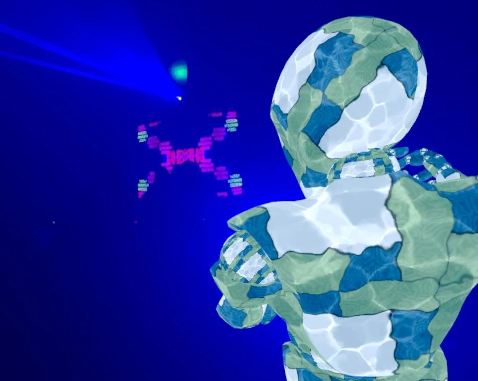

# TU856/TU857/TU858/TU984 Games Engines 1/eXtended Reality 2026

[What is Games Engines?](https://bryanduggan.org/2024/09/05/what-is-games-engines/)

```
Welcome to the Metaverse
```



## Assessment
- [50% Assignment](assignment.md)
- 50% Exam 

# Resources
- [CSResources git repo](https://github.com/skooter500/csresources/blob/main/git_ref.pdf). Here you will find links to the previous courses and all my quick references
- [Godot for beginners](https://www.youtube.com/watch?v=LOhfqjmasi0)
- [GDScript Tutorial](https://www.youtube.com/watch?v=e1zJS31tr88)
- [5 Games Made in Godot to inspire you each week](https://www.youtube.com/@stayathomedev) 
- [Game dev news channel](https://www.youtube.com/@gamefromscratch)
- [Godot discord](https://discord.com/invite/godotengine)
- [Godot Gaedhleach](https://discord.gg/mku9aNaM3)

## Notes

## Week 3 - XR Nodes

## Lab


## Week 2 - Intro to Godot - Main elements

## Lab
Setting up headsets

## Week 1 - Intro to the course

Clone these repos and explore:

- [https://github.com/skooter500/GE1-2024](https://github.com/skooter500/GE1-2024)
- [https://github.com/skooter500/questsdg](https://github.com/skooter500/questsdg)
